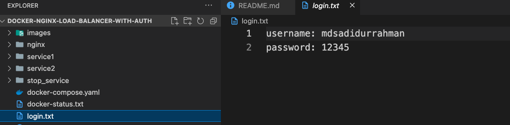

# Docker Compose NGINX Gateway with Load Balancing and Authentication

## Project Overview

This project demonstrates the integration of an NGINX gateway and a web interface in front of two services running in Docker Compose. The gateway provides load balancing, basic authentication, and a simple web interface to interact with the services. Service 1 will have three instances, and NGINX will distribute requests to these instances using a round-robin algorithm. Users can interact with the system through a web browser, where they can make requests to Service 1, view the response, and stop all services.

## Features
- **Basic Authentication**: Protect the system with a username and password.
- **Load Balancing**: NGINX distributes requests to three instances of Service 1.
- **Web Interface**:
  - Login page for secure access.
  - After login, users can:
    - Make requests to Service 1 and view responses.
    - Stop all services by clicking a “STOP” button.
- **Service Shutdown**: The "STOP" button stops all running containers and shuts down the system.


## System Requirements
- Docker
- Docker Compose
- Python 3.9+
- Flask

## How to Run

### 1. Clone the Repository

```bash
git clone https://github.com/shaikat1993/docker-nginx-load-balancer-with-auth.git
cd <your_project_directory>
```

### 2. Build and Start All Services To build the images and start all services, run the following command :
***(in the root folder)***

```bash
docker compose up --build
```

- **This will start:**
  - Service 1 (Python-based service).
  - Service 2 (Node.js-based service).
  - NGINX gateway for load balancing.
  - Web interface with login functionality.

- **Service Shutdown:** Clicking the "STOP" button stops all running containers and shuts down the system.


### 3. Access the Web Interface After a few seconds, open your browser and go to:
```bash
http://localhost:8198
```


### 3. You will be prompted to log in with the following credentials:

- You will found it in login.txt file 

```bash
Username: mdsadidurrahman
Password: 12345
```

- **Upon successful login, you will be presented with a page containing:**
### 4. Upon successful login, you will be presented with a page containing:

  - A text area showing the response from Service 1.
  - A REQUEST button to send a request to Service 1.
  - A STOP button to stop all services.
  

- **Stopping the Services:** To stop all services, press the STOP button on the web interface. This will trigger the docker compose down command, which stops and removes all running containers.

A text area showing the response from Service 1.
A REQUEST button to send a request to Service 1.
A STOP button to stop all services.
Stopping the Services
To stop all services, press the STOP button on the web interface. This will trigger the docker compose down command, which stops and removes all running containers.


### 5. Additional Information
  - The system uses round-robin load balancing for Service 1 through the NGINX gateway.
  - Basic authentication is implemented using credentials stored in a login.txt file.
  - A REQUEST button to send a request to Service 1.
  - A STOP button to stop all services.

### 5. Troubleshooting
If the web interface does not load, ensure that the containers are running by checking the output of:

```bash
docker ps
```
### 6. Need future improvement
- Currently its showing in the terminal that all the containers have been removed but still the service is running. Need to improve the funcationility more efficiently.

### 6. License:
This project is licensed under the MIT License - see the LICENSE file for details.